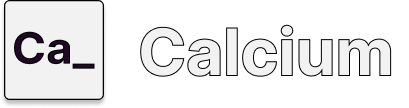

  

         

**Calcium is a real-time collaborator code editor for active brainstorming.**

# How does Calcium work?

To access to calcium use the provided link: https://calcium-webapp.vercel.app/

## Architecture

Calcium is a microarchitecture-based cloud application that provides a real-time collaborative code editing environment. It leverages a variety of technologies to deliver a seamless user experience. The frontend of the application is built using React and Next.js, providing an interactive UI where users can write and edit code. The backend, built with NestJS and Fastify, handles API requests, manages user sessions, and coordinates the creation and management of Docker containers. When a user executes code, a Docker container is spun up with the necessary runtime environments and libraries. This isolated execution environment ensures safety and consistency. User data and session information are stored in a PostgreSQL database. The entire application is hosted on Microsoft Azure and Vercel, providing robust and scalable cloud infrastructure. Real-time collaboration is facilitated through websockets, allowing instant sharing of code changes among users.

# Why Calcium?

Calcium is designed to enhance collaborative coding sessions and streamline the remote brainstorming process. Its real-time code editing capabilities enable multiple developers to work together seamlessly, fostering effective communication and productive idea exchange.

With Calcium, you can:

- **Collaborate in Real-Time:** Invite team members to join your coding session, and watch as they type and make changes to the shared codebase. Calcium's real-time synchronization ensures that everyone is always on the same page, facilitating instant feedback and iterative problem-solving.

- **Brainstorm Effectively:** Calcium's intuitive interface and collaborative features make it an ideal platform for active brainstorming sessions. Developers can propose ideas, experiment with code snippets, and iterate on solutions together, leading to more creative and robust outcomes.

- **Streamline Remote Work:** In today's distributed workforce, remote collaboration is essential. Calcium bridges the gap between remote team members, providing a virtual coding environment that replicates the experience of working together in person with a huge whiteboard to express ideas.

- **Enhance Knowledge Sharing:** Calcium's collaborative nature encourages knowledge sharing and mentoring within development teams. Experienced developers can guide and provide real-time feedback to junior team members, fostering a culture of continuous learning and skill development.

- **Ensure Secure Execution:** Calcium employs isolated Docker containers to execute code, ensuring a safe and secure environment for experimentation and exploration without risking system resources or compromising data.

By harnessing the power of real-time collaboration, Calcium empowers development teams to work more efficiently, innovate faster, and deliver high-quality software solutions.

# Usage

First access the following [link](https://calcium-webapp.vercel.app/).

After you have successfully logged in you will be redirected to *My boards* where existing boards will show up as shown below.

Boards are the heart of Calcium. Here you will provided with a whiteboard for drawing, expressing ideas, composing diagrams etc. In addition, your board comes with a terminal and text-editor packed.

## Creating a board

Firstly, click on the + button on the bottom left side of the screen and the following window will pop up.

As it can be seen, a random name is generated you can choose whether change or keep it. Furthermore, you may select desired runtime.

## Using your first board!

Once created you will be displayed with a board like shown below! Now feel free to collaborate and invite colleagues to code

## Sharing my room

Click on share and the following window will be prompted. Now share the link and that is you are rolling with calcium!.

## Deleting a board

In My boards you will be able to delete a board clicking the three dots

# Future Functionalities
### File System

Right now, Calcium only supports one file being edited and executed at a time, however, to have the full experience of a code editor we want to include a file explorer tab, where the user can create multiple directories and scripts, similar to how VS Code implements this functionaloty.

### Calcium Community

We want to create a community of passionate developers to work on Calcium as an open source project, so that the development speed grows exponentially and so that we can add different points of views on how to improve the functionalities of our application.

# Students List

- Roberto Carlos Gil Garcia
- Giuseppe Armando Gomez Donado
- Juan David Padilla Diaz
- Kenny Don Jie Zhu Ye
